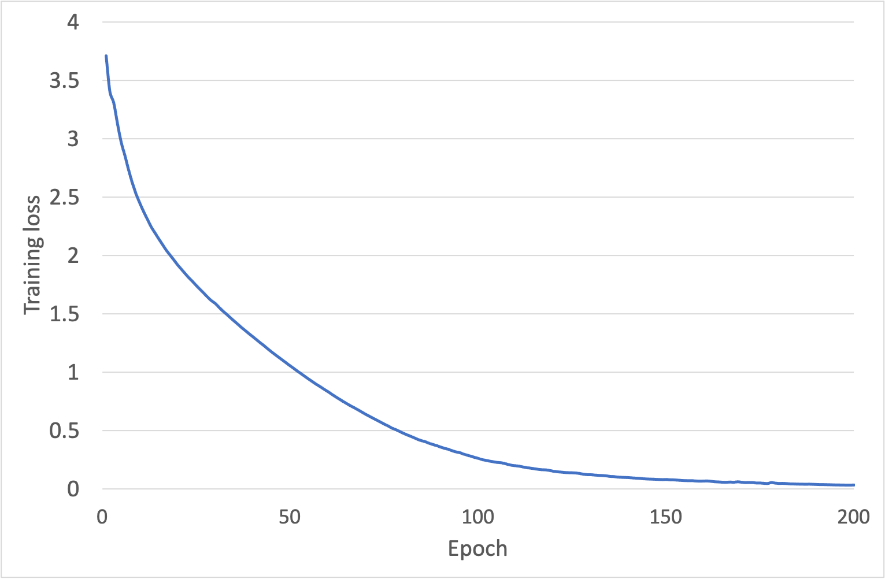
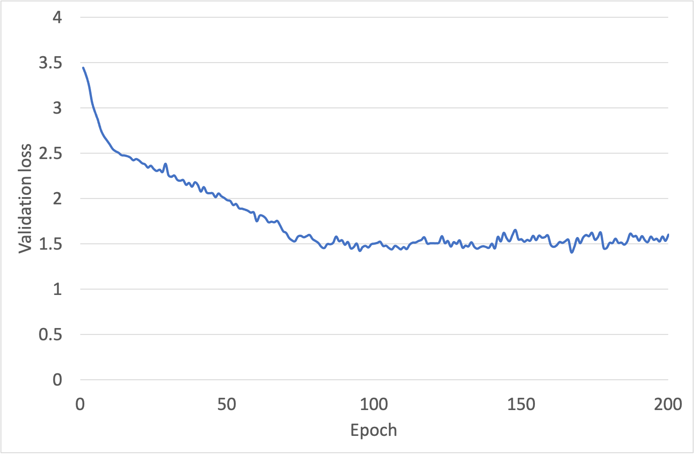
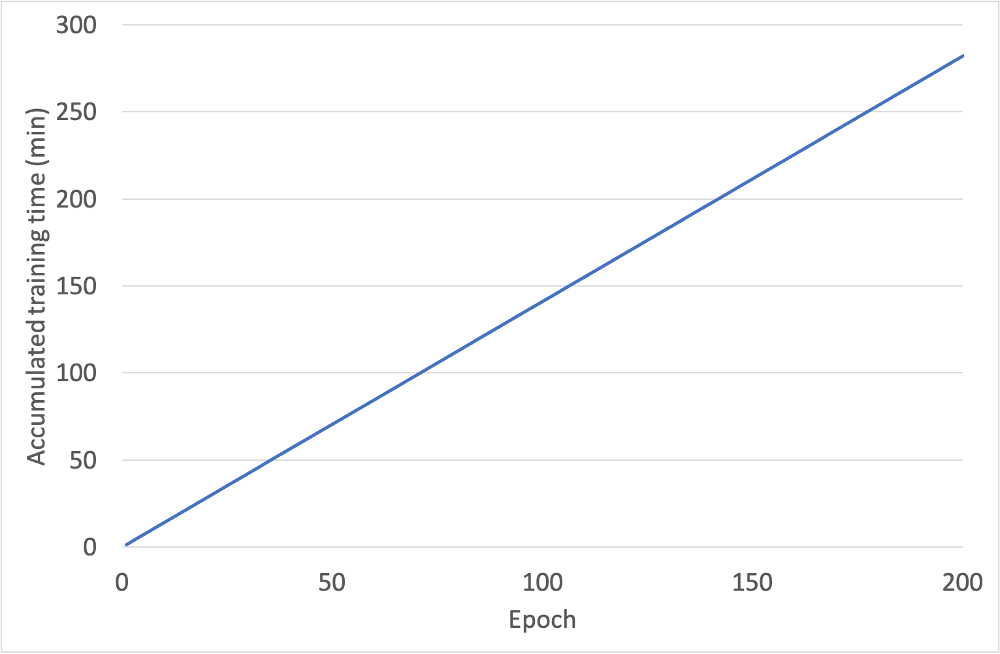

# DeepFix Experiment Artifact

This artifact contains the source code, data and results of our experimental attemption for migrating DeepFix to solve C# compilation errors.

## Approach Overview

In DeepFix, compilation errors are solved via applying a fix suggested by a neural network. In order to solve multiple compilation errors, one has to train multiple neural networks separately, one for each kind of compilation error. To train one such neural network (for solving a certain kind of compilation error), the user has to develop a domain-specific mutator which transforms a correct program into an erroneous program that exactly reflects that kind of compilation error. In their experiment, two mutators are provided: "typo" (syntax errors such as duplicating/missing a delimiter) and "undeclared variables". To support the repair of other kinds of compilation errors (e.g. the errors listed in Table 1 and Table 2), plenty of mutators have to be developed by hand. Since the authors are not experts of DeepFix, mutators developed by our own may considered to be biased. Instead, we only migrate the provided typo mutator to support C# (note the original ones are for C) for training data generation.

Specifically, this typo mutator does the following mutation operations (source code `data_processing/typo_mutator.py`):
- delete a `(`, `)`, `,`, `;`, `{` or `}` (the fix will be add the deleted delimiter)
- duplicate a `(`, `)`, `,`, `{` or `}` (the fix will be remove the duplicated delimiter)
- replacement: replace `;` with `,`, replace `,` with `;`, replace `;` with `.`, or replace `);` with `;)` (the fix will be the reverse)

Using the generated data, we are ready to train a neural network with the original parameters (except that we increase the epochs so that the training loss is decreased to a low value). The neural network is then used to test against our testing set (Section 7.2). The fixed program produced by DeepFix is checked using the standard C# compiler.

## Changes

Compared with the original codebase of DeepFix (https://bitbucket.org/iiscseal/deepfix/src/master/), we have made the following changes:

* The C# dataset is provided;
* A C# tokenizer is migrated from the original C tokenizer;
* The typo mutator is migrated to support C#;
* The training script is modified to accept the C# dataset;
* The testing (or prediction) script is modified to invoke the C# compiler.

## Prerequisite

To reproduce the experiments, you must have `cuda`, `conda` and `mono` installed on a machine running Linux. Also, an Nvidia GPU that supports `cuda` is required.

The following are the versions of the softwares on our machine:

```
$ cat /usr/local/cuda/version.txt
CUDA Version 10.0.130
$ conda --version
conda 4.9.1
$ mcs --version
Mono C# compiler version 4.6.2.0
```

## Reproducing Steps

All steps have been summarized in the script `e2e-cs.sh` so you just need to execute `bash e2e-cs.sh`. In detail, this scripts does the following:

1. Set up Python `conda` environment and install all necessary packages.
2. Prepare training data.
3. Conduct one-fold training.
4. Test against our testing set using the trained neural network model. Testing results are output to `proc_cs.json`.

## Results

Our experiments were conducted on a machine with the following configurations:

* Ubuntu 18.04.3 LTS
* Intel(R) Xeon(R) CPU E5-2620 v4 @ 2.10GHz
* 64 GB memory
* GPU 0~6: GeForce RTX 2080 Ti

### Training

The data set consists of 5,156 examples, where 3,870 are used for training and 1,286 for validation. The following curve presents the training loss after each epoch (in total there were 200 epochs, the final loss was 0.03):



The following curve presents the validation loss after each epoch (the final loss was 1.60):



The following curve presents the accumulated training time after each epoch (the total time was 281.96 min):



All training data were saved to `results/train.xlsx`.

### Testing

15 out of 2000 testcases were successfully solved by DeepFix. All these 15 testcases belong to the CS0022 error category: unmatched array dimension. Manually inspecting these testcases, we realized the repairing strategy of the neural network is actually "fix declaration: increase dimension" (i.e. C#03 of Table 1). The reason why the neural network learned from typo training data can apply such a repairing strategy is that this strategy happens to require a simple syntactic change: add a comma (`,`) in between `[]`. Note that such a syntactic change is already covered by the typo mutation rules.

All these testcases are listed in `results/solved/`. For example, in `results/solved/CS0022/0/`:

* `0.cs` is the input (erroneous) version;
* `1.cs` is the output (fixed) version; and
* `a.json` gives meta information of this testcase.

The input version `0.cs`:

```cs
using System;
using System.Linq;
public class Test {
  static int[] a = new int[10]; // unmatched array dimension
  public static void Main() {
    for (int i = 0; i != 10; i++) {
      a[i, 0] = i + 99;
    }
  }
}
```

The output version `1.cs`:

```cs
using System; 
using System.Linq; 
public class Test {
  static int [,] a = new int [ 0 , 0 ]; // [] -> [,]
  public static void Main() { 
    for (int i = 0 ; i != 0 ; i++) { 
      a[i, 0]= i + 0;
    }
  }
}
```

Note the array dimension of `a` is increased after fixing. However, even the above program can compile, the semantics has been changed: `a` now has dimension `0 * 0`, the first dimension `10` is lost.

Finally, the meta information of this testcase `a.json` (meaning of each key is explained in the comments):

```json
{
  "raw_code": "using System;\nusing System.Linq;\npublic class Test {\n  static int[] a = new int[10];\n  public static void Main() {\n    for (int i = 0; i != 10; i++) {\n      a[i, 0] = i + 99\n      /* updated */\n      ;\n    }\n  }\n}\n", // input version code
  "raw_error_count": 1, // how many compilation errors are in the input version
  "final_code": "\nusing System ; \nusing System . Linq ; \npublic class Test { \nstatic int [,] a = new int [ 0 , 0 ]; \npublic static void Main (){ \nfor ( int i = 0 ; i != 0 ; i ++){ \na [ i , 0 ]= i + 0 \n;}}} ", // final output version after several iterations of fixing
  "final_error_count": 0, // how many compilation errors are in the final output version
  "iteration_count": 1,  // how many fixing iterations are needed from input to the final output
}
```
